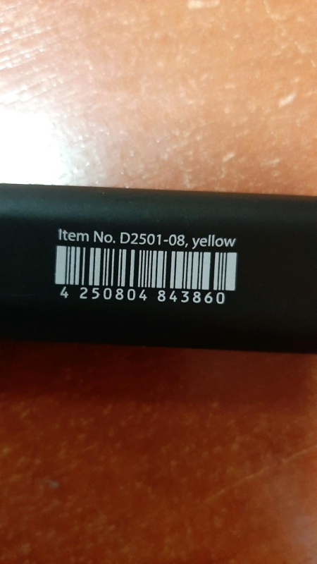
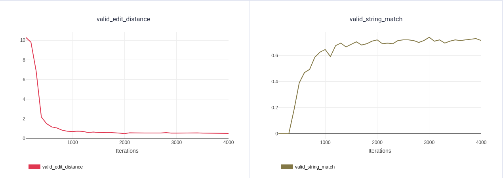

# Распознавание номера штрихкода

Для распознавания штрихкода, будем использовать CRNN из домашки по OCR

## Данные
Датасет, собранный на Толоке в формате tsv, где есть информация о позиции штрихкода и цифры, которые на нём написаны

Для тренировки и валидации данные разбиты в таком формате:

|  train | val    
| ------ | -------
|  337   |   144    


## Как запустить

В корне репозитория лежит Makefile, в котором есть необходимые для запуска команды:

`make setup` - создаёт виртуальное окружение, загружает зависимости и скачивает данные через dvc

`make train` - запускает обучение с файлом конфигурации из *configs/base_config.yaml*, его можно изменить или определить другой в Makefile

`make export_onnx` - экспортирует модель в ONNX для дальнейшего инференса. Чтобы указать путь до модели надо переопределить переменную в Makefile или при запуске указать `MODEL_CKPT_PATH=путь_до_весов`

## Результаты

В отличии от домашки здесь была изменён бэкбон на EffNetB5, добавлен sheduler, а также механизм анализа loss функции для каждого объекта валидационной выборки. С помощью анализа лосса на фотках был найден такой интересный образец в данных:



Лучший запуск ([ClearML](https://app.clear.ml/projects/01ad3a0a6cbf4de2a878e3295adb56f5/experiments/88eaf4bc4b4a43a480909848519dda9b/output/execution)):

```
┏━━━━━━━━━━━━━━━━━━━━━━━━━━━┳━━━━━━━━━━━━━━━━━━━━━━━━━━━┓
┃      Validate metric      ┃       DataLoader 0        ┃
┡━━━━━━━━━━━━━━━━━━━━━━━━━━━╇━━━━━━━━━━━━━━━━━━━━━━━━━━━┩
│      valid_ctc_loss       │    0.19599737226963043    │
│    valid_edit_distance    │    0.5221675038337708     │
│    valid_string_match     │    0.7290640473365784     │
│     valid_total_loss      │    0.19599737226963043    │
└───────────────────────────┴───────────────────────────┘
```

Графики метрик для данного запуска:

